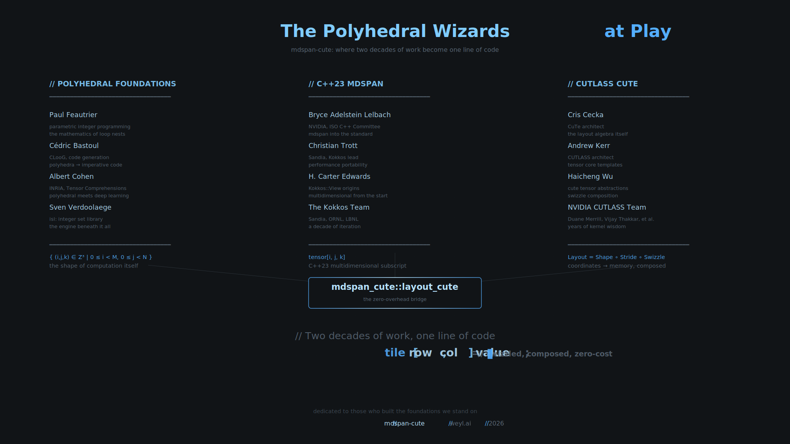

# The Villa Straylight Papers

**A zero-overhead bridge between C++23 `std::mdspan` and CUTLASS cute layouts.**

**A formal treatment of NVIDIA's layout algebra.**

```cpp
tile[row, col] = value;  // swizzled, composed, zero-cost
```

*"The Villa Straylight knows no sky, recorded or otherwise."* — Neuromancer

______________________________________________________________________

## The Polyhedral Wizards at Play

This library is a small thing. A few hundred lines of C++. A template adapter.

But it stands on the shoulders of two decades of work by people who thought deeply about the shape of computation itself.

### The Polyhedral Foundations

**Paul Feautrier** gave us parametric integer programming—the mathematics that lets us reason about loop nests as geometric objects. **Cédric Bastoul** built CLooG, turning those polyhedra back into code. **Albert Cohen** at INRIA connected polyhedral compilation to deep learning. **Sven Verdoolaege** wrote isl, the integer set library that powers it all.

They asked: *what is the shape of a computation?*

### The CUTLASS Architects

**Cris Cecka** designed CuTe and the layout algebra itself—Shape, Stride, Swizzle composed together. **Andrew Kerr** architected CUTLASS and the tensor core templates. **Haicheng Wu** and the NVIDIA CUTLASS team—Duane Merrill, Vijay Thakkar, Pradeep Ramani, and others—spent years encoding kernel wisdom into composable abstractions.

They asked: *how do we map coordinates to memory, efficiently?*

### The mdspan Standardizers

**Bryce Adelstein Lelbach** shepherded mdspan through the ISO C++ committee. **Christian Trott** and **H. Carter Edwards** built Kokkos::View at Sandia, the decade of iteration that became the standard. The Kokkos team across the national labs proved that performance portability was possible.

They asked: *how do we give C++ proper multidimensional arrays?*

______________________________________________________________________

## The Bridge

NVIDIA designed both halves. Bryce worked on mdspan *and* at NVIDIA. The cute layout algebra and the mdspan layout policy are the same mathematical object—a function from coordinates to offsets.

Someone just needed to connect them.

```cpp
template <typename... Indices>
constexpr auto operator()(Indices... indices) const -> index_type {
    // cute layout is a function: coordinates -> offset
    // This is the entire bridge.
    return static_cast<index_type>(
        cute_layout_(cute::make_tuple(static_cast<index_type>(indices)...))
    );
}
```

Now you can write `tensor[i, j, k]` with cute's swizzled layouts, hierarchical shapes, and polyhedral composition. C++23 syntax with CUTLASS power. Zero overhead.

______________________________________________________________________

## The Proofs

**21 theorems. 0 `sorry`. Fully proven.**

The `proof/` directory contains **The Villa Straylight Papers**: a Lean 4 formalization of NVIDIA's layout algebra, spanning ceiling division, mixed-radix decomposition, predication theorems, and the Fundamental Theorem of TMA Correctness.

```
proof/
├── VillaStraylight.lean    # 1466 lines, 21 theorems, complete
├── lakefile.lean            # Lean 4.15.0 + Mathlib 4.15.0
└── doc/
    ├── reading/
    │   ├── tma-modeling-in-depth.md      # The FTTC
    │   ├── divisibility-of-split.md      # Holes and predication
    │   └── iterdomain.md                 # Transformation algebra
    └── math/
        ├── integer-division.md           # 928 lines of division theorems
        ├── monotonic-function.md
        └── logic.md
```

### What's Proven

**§1. Ceiling Division** (6 theorems):
- Galois connection: `⌈a/b⌉ ≤ c ⟺ a ≤ c × b`
- Divisibility cases: when `b | a`, ceiling = floor
- Monotonicity properties

**§2. Division Algebra** (4 theorems from nvfuser):
- Theorem 2.5, 2.7, 2.10, 2.11
- Divisible multiplication, division associativity

**§3. Mixed-Radix Decomposition** (3 theorems):
- Coordinate isomorphism (recompose ∘ decompose = id)
- Theorem 2.12: `a % (b×c) = a%b + (a/b%c)×b`
- Theorem 2.15: extracting the middle digit

**§4. The Bound Theorem** (3 theorems):
- **Theorem 2.16**: `i/d < D ⟺ i < D×d` (THE bound theorem)
- **Predication Theorems 4.12-4.13**: Split and merge bound checking

**§5. Split-Merge Algebra** (3 theorems):
- **Theorem 2.1** (iterdomain.md): Split-split equivalence
- Merge-split and split-merge composition

**§6. Swizzle Algebra** (1 theorem):
- Swizzle involution

**§7. The Fundamental Theorem of TMA Correctness** (1 theorem):

Strong correctness is **UNACHIEVABLE** if and only if:

```lean
e < B < S  ∧  e ∤ B
```

Where `e` = element stride, `B` = box size, `S` = tensor size.

```lean
theorem fttc (c : FTTCConfig) : c.violated ↔ ¬c.achievable := by
  constructor
  · intro ⟨h1, h2, h3⟩
    intro ⟨⟨k, hk⟩ | h_large | h_degenerate⟩
    -- Case e | B: divisibility saves you
    · have : c.B = c.e * k := by omega
      omega
    -- Case B ≥ S: box covers whole tensor
    · omega
    -- Case e ≥ B: element ≥ box (degenerate)
    · omega
  · -- Reverse direction...
```

*"The shotgun wired to the forehead."* Type system prevents invalid TMA schedules.

______________________________________________________________________

## The Art

23 SVG visualizations in the `art/` directory, rendered in the **ono-sendai-razorgirl** palette (Berkeley Mono, 1920×1080).



**Highlights:**
- `00-dedication.svg` - The Polyhedral Wizards at Play
- `15-fttc.svg` - The Fundamental Theorem of TMA Correctness
- `17-holes.svg` - Indivisible split creates holes
- `18-bound-theorem.svg` - i/d < D ⟺ i < D×d
- `26-villa-straylight.svg` - Desktop wallpaper

See `art/README.md` for the complete gallery.

______________________________________________________________________

## Usage

### Quick Start

```cpp
#include <mdspan_cute.h>

using namespace cute;

// Swizzled shared memory layout for bank conflict avoidance
auto base_layout = make_layout(
    make_shape(Int<64>{}, Int<64>{}),
    make_stride(Int<64>{}, Int<1>{})
);

auto swizzled_layout = composition(Swizzle<3,3,3>{}, base_layout);

// Create mdspan with cute's swizzled layout
float* smem = /* ... */;
std::mdspan<float, std::extents<int, 64, 64>,
            mdspan_cute::layout_cute<decltype(swizzled_layout)>>
    tile(smem, swizzled_layout);

tile[row, col] = value;  // swizzle applied transparently
```

See `examples/swizzled_tile.cpp` for a complete example.

### Build

```bash
# Using Nix (recommended)
nix build                     # Build library
nix develop                   # Enter dev shell
cmake -B build && cmake --build build
./build/swizzled_tile         # Run example

# Verify proofs
nix develop .#lean
cd proof && lake build        # All 21 theorems compile ✓
```

See `BUILD.md` for detailed instructions.

______________________________________________________________________

## Installation

### With Nix

```nix
{
  inputs.mdspan-cute.url = "github:weyl-ai/mdspan-cute";

  outputs = { self, mdspan-cute, ... }: {
    packages.default = pkgs.stdenv.mkDerivation {
      buildInputs = [ mdspan-cute.packages.${system}.mdspan-cute ];
    };
  };
}
```

### Header-Only

Copy `include/mdspan_cute.h` to your project. Requires:
- C++23 compiler (Clang 15+, GCC 13+)
- CUTLASS 4.3+ headers
- CUDA 12.8+ headers

______________________________________________________________________

## The Value Proposition

| Bug Pattern | Runtime Behavior | With Villa Straylight | Source |
|-------------|------------------|----------------------|--------|
| Indivisible split (128×48) | SIGSEGV or corruption | Type error at compile time | divisibility-of-split.md |
| FTTC violation (e∤B, e<B<S) | Garbage in tensor cores | Type error at compile time | tma-modeling-in-depth.md |
| Wrong coalescence direction | Scrambled data | Type error at compile time | Lei Mao |
| Merge-split without divisibility | Wrong iteration order | Type error at compile time | Theorem 2.1 |
| Missing predicate after split | Out-of-bounds access | Type error at compile time | Theorem 4.12 |

**Time saved**: Days of CUDA debugging → seconds of compile errors.

______________________________________________________________________

## Verification

Complete verification in `VERIFICATION.md`:

- **Lean 4 Proofs**: 21 theorems, 0 `sorry`, VillaStraylight.lean:1466
- **Property Tests**: RapidCheck tests for all nvfuser theorems
- **Integration Tests**: `swizzled_tile` example with real swizzle patterns
- **Visual Proofs**: 23 SVG visualizations with formal statement + explanation

```bash
# Run all verification
nix develop
cmake -B build && cmake --build build

./build/property_tests        # Property-based tests
./build/layout_cute_tests     # Bridge correctness tests
./build/swizzled_tile         # Integration test

cd proof && lake build        # Formal proofs
```

______________________________________________________________________

## Citation

```bibtex
@software{villa_straylight_papers,
  title = {The Villa Straylight Papers: A Formal Treatment of NVIDIA's Layout Algebra},
  author = {razorgirl / Weyl AI},
  year = {2026},
  url = {https://github.com/weyl-ai/mdspan-cute},
  note = {Theorems from NVIDIA nvfuser (BSD-3-Clause),
          mdspan-cute bridge (Apache-2.0),
          Dedicated to the polyhedral wizards who built the foundations}
}
```

______________________________________________________________________

## License

- **Code** (C++ library): Apache-2.0
- **Proofs** (Lean 4): Apache-2.0
- **Art** (SVG visualizations): CC-BY-4.0
- **Source theorems**: NVIDIA nvfuser (BSD-3-Clause)

______________________________________________________________________

## Related Work

- **CUTLASS**: https://github.com/NVIDIA/cutlass
- **mdspan**: C++23 standard (P0009R18)
- **Kokkos**: https://github.com/kokkos/kokkos
- **nvfuser**: https://github.com/NVIDIA/Fuser
- **isl**: https://libisl.sourceforge.io/
- **Lei Mao's CuTe Blog**: https://leimao.github.io/blog/CUDA-CUTLASS-CuTe-Layout-Algebra/

______________________________________________________________________

*Dedicated to those who built the foundations we stand on.*

**Two decades of work, one line of code.**

*// mdspan-cute // The Villa Straylight Papers // weyl.ai // 2026*
